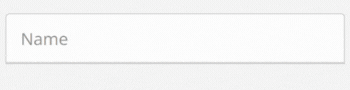

<strong>Use Example</strong><br>
```html
<input-field
  formControlName="name"
  label="Name"
  placeholder="Enter your name"
/>
```
You only pass the label and placeholder for display and the form control name for serving it to the reactive form's form builder. This one will handle the error messages, together with the built in features.
